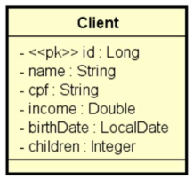

# Desafio 3 DevSuperior - CRUD de clientes
Terceiro desafio do curso Java Spring Professional do Professor Nélio Alves - Dev Superior.

## Descrição do desafio:
Você deverá entregar um projeto Spring Boot contendo um CRUD completo de web services REST para
acessar um recurso de clientes, contendo as cinco operações básicas aprendidas no capítulo:
- Busca paginada de recursos
- Busca de recurso por id
- Inserir novo recurso
- Atualizar recurso
- Deletar recurso

O projeto deverá estar com um ambiente de testes configurado acessando o banco de dados H2, deverá usar
Maven como gerenciador de dependência, e Java como linguagem.

Um cliente possui nome, CPF, renda, data de nascimento, e quantidade de filhos. A especificação da
entidade Client é mostrada a seguir (você deve seguir à risca os nomes de classe e atributos mostrados no
diagrama):

Seu projeto deverá fazer um seed de pelo menos 10 clientes com dados SIGNIFICATIVOS (não é para
usar dados sem significado como “Nome 1”, “Nome 2”, etc.).

Seu projeto deverá tratar as seguintes exceções:
- Id não encontrado (para GET por id, PUT e DELETE), retornando código 404.
- Erro de validação, retornando código 422 e mensagens customizada para cada campo inválido. As
regras de validação são:
  - Nome: não pode ser vazio
  - Data de nascimento: não pode ser data futura (dica: use @PastOrPresent)

## Critérios de avaliação:
- [x] Busca por id retorna cliente existente;
- [x] Busca por id retorna 404 para cliente inexistente;
- [x] Busca paginada retorna listagem paginada corretamente;
- [x] Inserção de cliente insere cliente com dados válidos;
- [x] Inserção de cliente retorna 422 e mensagens customizadas com dados inválidos;
- [x] Atualização de cliente atualiza cliente com dados válidos;
- [x] Atualização de cliente retorna 404 para cliente inexistente;
- [x] Atualização de cliente retorna 422 e mensagens customizadas com dados inválidos;
- [x] Deleção de cliente deleta cliente existente;
- [x] Deleção de cliente retorna 404 para cliente inexistente.

## Competências avaliadas:
- Implementação de operações de CRUD;
- Tratamento de exceções;
- Customização de respostas HTTP;
- Validação de dados com Bean Validation.

## Desafios anteriores:
1. https://github.com/paulorc-silva/Desafio-DevSuperior-Componentes-DI
2. https://github.com/paulorc-silva/Desafio-DevSuperior-Dominio-ORM